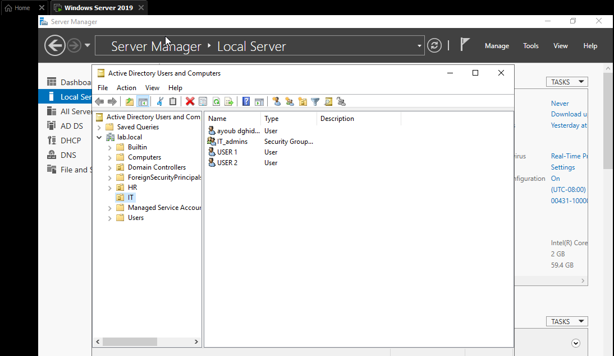
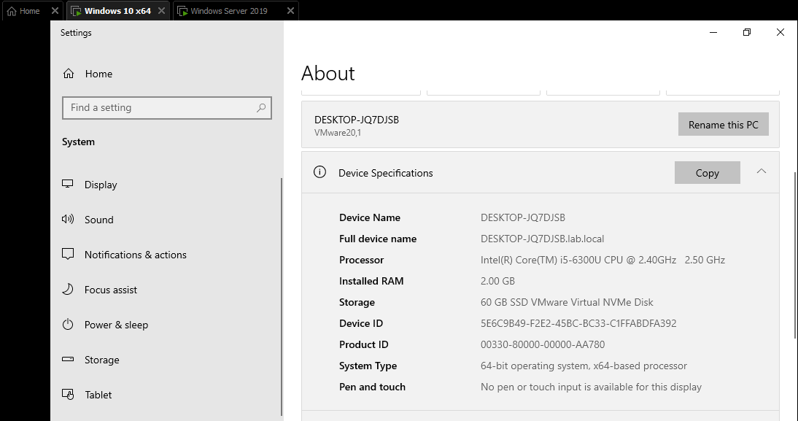
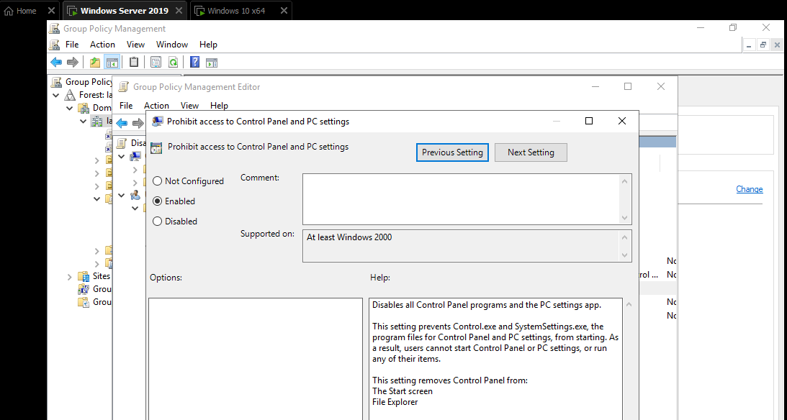
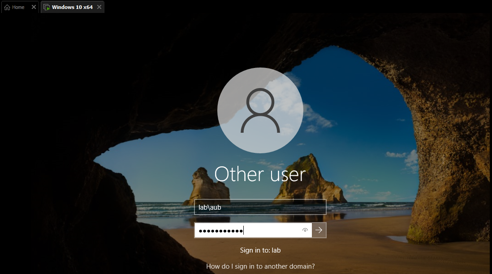

# Active-Directory-Lab
Windows Server 2019 Active Directory Home Lab Project

## Technologies Used
- Windows Server 2019  
- Windows 10  
- VMware Workstation  

## What I Configured
- Installed and configured Active Directory Domain Services (AD DS)  
- Promoted server to Domain Controller  
- Configured DNS server  
- Created Organizational Units (OU)  
- Created users and security groups  
- Joined Windows 10 client to domain  
- Implemented Group Policy (GPO) to restrict Control Panel access
  
## Network Configuration
- Network Type: NAT  
- Network Range: 192.168.253.0/24  
- Domain: lab.local  
- Domain Controller IP: 192.168.253.10  

## Screenshots

### Active Directory Users

### Domain Join

### Group Policy Configuration

### User Login

## Skills Demonstrated
- Active Directory Administration  
- DNS Configuration  
- User & Group Management  
- Group Policy Management  
- Troubleshooting Networking Issues  

## 📌 Conclusion
This lab helped me understand how to deploy and manage Active Directory in a controlled environment, including user administration and policy enforcement.
